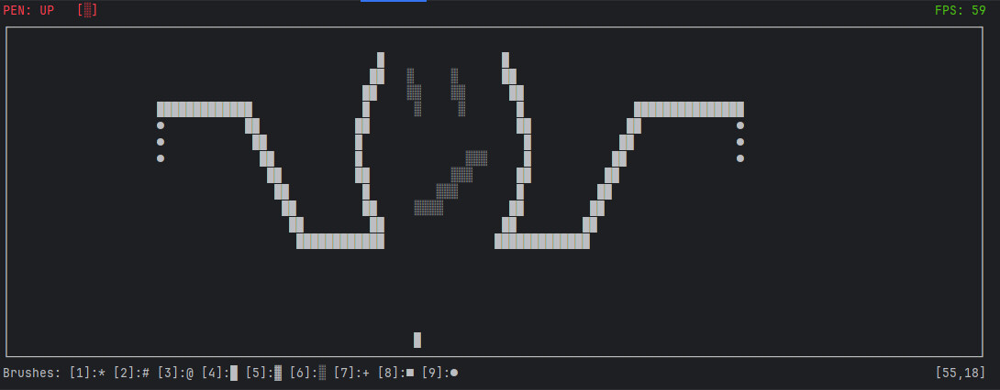

# Terminal Canvas Editor

A terminal-based drawing application written in Rust, created as a learning project to explore event handling, rendering, and UI architecture concepts.



## Features

- **Drawing** - Draw ASCII art in terminal
- **Multiple brushes** - 9 different brush characters
- **Pen control** - Toggle pen up/down
- **Canvas management** - Clear canvas with 'c', automatic resize on terminal resize
- **Other** - FPS counter (frame limited to 60 FPS), cursor coordinates, pen status, and brush palette

## How to use

- **q**: exit application
- **c**: clear canvas
- **1-9**: select brush
- **spacebar**: toggle pen mode (up / down)

## How to run

```bash
git clone https://github.com/AdrianVisnovsky/terminal-canvas-editor.git
cd terminal-canvas
cargo build --release
# executable located at .\target\release\terminal-canvas-editor
```